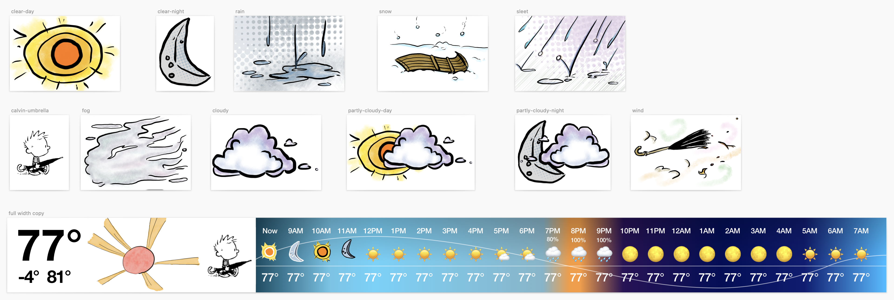

# GudTay

It started with [this Calvin and Hobbes comic from April 9th, 1995](https://www.gocomics.com/calvinandhobbes/1995/04/09):

![A colorful Calvin and Hobbes sunday comic. Calvin, a 6-year-old boy, is being tossed out the front door by his mom, who says, “get going, or you’ll miss the school bus.” He grumbles as he walks to the bus stop. Suddenly, in a cloud of dust, an alien lands in a small one-seat spaceship. The alien is green, with a pig snout, tentacles, an orange hat, and headphones. It greets Calvin in an unknown alien language. Calvin says, “Uh… greetings. My name is Calvin.” The alien says something short in its language. The alien poofs away in a sudden explosion, causing Calvin to cover his eyes. When he opens them again, he sees an exact duplicate of himself. It speaks in the style of the alien, but with a phonetic rendering of Calvin’s words: “GRITTINGS. MA NAM IS KAHLFIN.” As Calvin looks on, bemused, the alien repeats “GRITTINGS. MA NAM IS KAHLFIN.” Calvin, struck by inspiration, says, “Um… Yes! Well Calvin, here’s your lunchbox. Have a good day at school.” Alien-Calvin repeats “HOFFA GUD TAY.” As Calvin scampers away, Alien-Calvin looks very pleased and repeats, “LUNBOKS.” Susie, Calvin’s classmate, walks up to the bus stop and says, “Hi Calvin.” Alien-Calvin replies “GRITTINGS. MA NAM IS KAHLFIN. HEERYOR LUNBOKS. HOFFA GUD TAY ASKOOL.” Later, we see Calvin’s mom bringing him home from school. She says, “Calvin’s principal says to say hello,” to which Calvin’s dad says, “Huh boy.” Calvin, still speaking in the alien voice, says, “IT TROO! DAT DARN KAHLFIN STOLE MA SPACECHIP!”](Graphics/readme/GudTayComic.jpg)

“Hoffa gud tay askool” and “heeryor lunboks” have become common phrases in our house. So when I decided to make a status board app for my wife an myself, calling it GudTay was the obvious choice. We had an old Retina iPad mini, which we mounted to the wall near the door:

## Project Timeline (selected highlights)

### July 24, 2016

Initial commit.

### July 15, 2016

First mockup in Sketch. Referenced the[MBTA style guide](https://www.mbta.com/engineering/design-standards-and-guidelines) from 1977 (the newest available at the time), which included information on how to obtain a physical specimen of Helvetica.

### August 7, 2016

Refined design, accounting for missing train times. Calvin makes an appearance.

### August 19, 2016

Initial designs for the weather section. The idea is that the hourly forecast will include the color that the sky will be at roughly that time of day. Also includes the start of sourcing images of various weather conditions from Calvin and Hobbes comics. My wife, [Cheryl](http://www.cherylpedersen.com), helped draw some custom conditions in the style of Calvin and Hobbes.

### January 14, 2017

More custom icons from Cheryl.

### September 2, 2017

Screenshot of the real app:

It includes:

- Departure times for four buses and trains that we were riding regularly at the time.
- A whiteboard for jotting quick notes that we would notice when walking out the door.
- Calvin. Tap him to show error logs. He is also joined by a hand-drawn analog clock that keeps correct time.
- The weather widget showing the color of the sky around sunrise.

### December 31, 2018

Apparently, I spent New Year’s Eve building image syncing. We had ended up with another old iPad at some point, and decided to wall-mount it near the dining room table so we could see when buses were leaving while eating breakfast. I used [Multipeer Connectivity](https://developer.apple.com/documentation/multipeerconnectivity) to allow the iPads to connect to each other, and I wrote a super crude mechanism for them to sync images back and forth. I originally had aspirations for building it using fancy [CRDTs like in Pixelboard](https://medium.com/bpxl-craft/building-a-peer-to-peer-whiteboarding-app-for-ipad-2a4c7728863e), but it turned out to be way more fiddly than I was interested in taking on for a side project, so I just sent the whole image over the network every time it changed, and the most recent timestamp always wins. It works fine as long as two people aren't drawing at exactly the same time.

### Jauary 12, 2019

Thanks to some help from [@jaredsinclair](https://github.com/jaredsinclair), I was able to make the whiteboard drawing much faster and more efficient. The trick is to set a layer’s `contents` directly to a `CGImage` made from a `CGBitmapContext`. As long as you don’t modify the context before the frame renders, you get to avoid a copy of the buffer.

### January 29, 2019

We’ve moved to a new house. Now we only care about one bus line, so we just show that. The whiteboard is larger. Calvin is walking

### February 20, 2019

Cheryl has been busy drawing more icons! Now Calvin dresses for the weather, and carries an umbrella when it’s raining (see example in previous screenshot). The image file names indicate the temperature range in Fahrenheit.

### March 14, 2020

Added an offline view so we would know not to trust bus departure times if the iPad had fallen offline.

### May 28-29, 2020

Adopted OpenWeatherMap API due to the deprecation of the DarkSky API I had been using previously.

### July 2, 2024

We stopped using GudTay a few years back when it stopped being fun updating this old app for iPads that didn’t run past iOS 11 or 12, and when we started working from home. But when [@armcknight](https://github.com/armcknight) asked if I had ever open-sourced this code, I got [nerd-sniped](https://xkcd.com/356/) hard and nearly pulled an all-nighter getting this into shape for publication. This included:

- Project cleanup for the first time since March of 2021.
- OpenWeatherMap doesn’t allow completely free accounts any more, so I migrated to Apple’s WeatherKit. It was surprisingly not that hard; the APIs have a very similar shape, at least for what I’m doing with them.
- Rebased the project to remove my OpenWeatherMap API key and the precise location of my home that I was using for the weather queries; now it’s centered on Boston.

Just for fun, here’s a video demo, which shows off two fun little animations that make me happy:

1. The clock hands ticking.
2. The tool switching on the whiteboard.

https://github.com/ZevEisenberg/GudTay/assets/464574/42403099-fe89-4115-a439-db051fd4e867

If you made it this far, hoffa gud tay askool!
